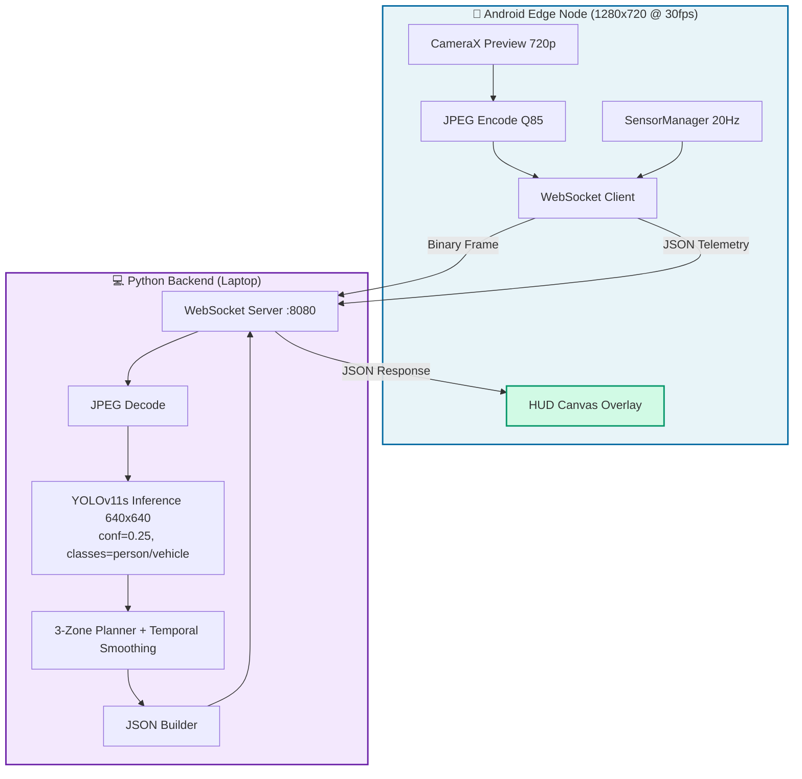
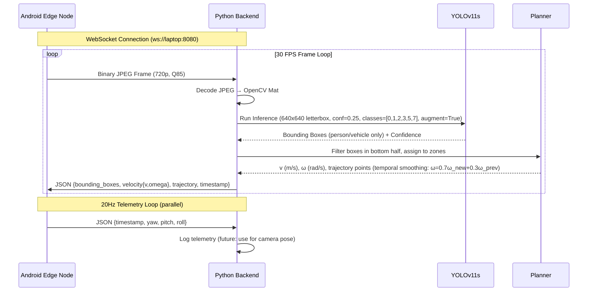
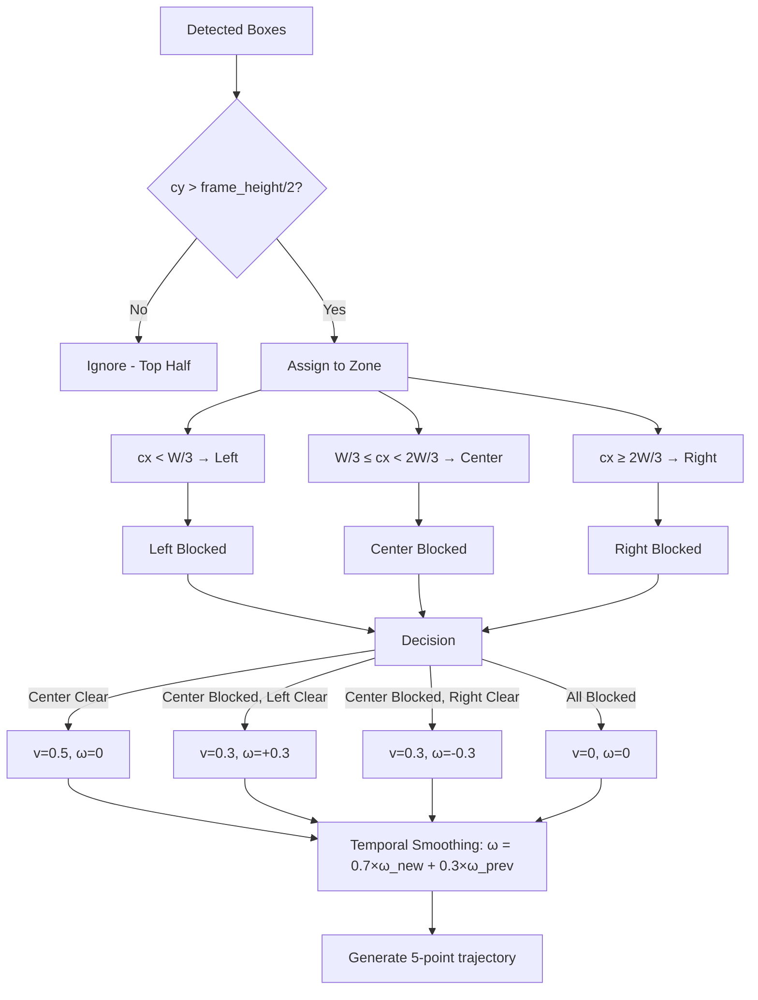

# UGV 1-Day Prototype - SIH 2026

End-to-end Android + Python prototype for an Unmanned Ground Vehicle (UGV) edge computing system. The Android phone captures camera frames, streams them via WebSocket to a laptop backend running YOLOv11s obstacle detection, receives navigation commands, and renders a real-time HUD overlay.

---

## Quick Start (5 Minutes)

### Prerequisites
- **Laptop**: Linux/macOS with Python 3.11+, NVIDIA GPU (recommended for YOLOv11s)
- **Android Phone**: API 24+ (Android 7.0+), same WiFi as laptop
- **Network**: Both devices on same WiFi, laptop firewall allows port 8080

### 1. Start Backend (Laptop)
```bash
cd prototype/backend
./setup.sh          # First time only (installs deps, downloads yolo11s.pt)
uv run python server.py
```

**Expected output:**
```
Loaded YOLO model from yolo11s.pt on device 0
YOLO detector initialized successfully
WebSocket server started on ws://0.0.0.0:8080
Ready for Android UGV Edge Node connections
```

### 2. Get Laptop IP
```bash
ip route get 1.1.1.1 | awk '{print $7}'
# Example: 192.168.0.105
```

### 3. Configure & Run Android App
1. Open `prototype/frontend/Android App` in Android Studio
2. Build & run on device (USB or wireless ADB)
3. App launches → **Grant Camera Permission**
4. Enter laptop IP: `192.168.0.105:8080` in the IP field
5. Tap **Connect**

### 4. Verify Connection

| Backend Terminal | Android Screen |
|------------------|----------------|
| `Client connected: ('192.168.0.105', 54321)` | Status: **STREAMING** (green pulse) |
| `Processed frame in 12.3ms | 2 detections | v=0.30 ω=0.30` | FPS: ~30 |
| | Red boxes on obstacles |
| | Green trajectory curve |
| | Velocity/steering gauges |

---

## Architecture



### Data Flow Sequence



---

## System Components

### Backend (Python) - `prototype/backend/`

| File | Responsibility | Lines |
|------|---------------|-------|
| `server.py` | WebSocket server, frame decoding, JSON I/O, orchestration | 125 |
| `perception.py` | `YOLODetector` - wraps Ultralytics **YOLOv11s** (conf=0.25, class filter, augment=True) | 51 |
| `planner.py` | `compute_navigation()` - 3-zone reactive obstacle avoidance + **temporal smoothing** | 146 |
| `requirements.txt` | Python dependencies | 6 |
| `yolo11s.pt` | Downloaded YOLOv11 small model (~18 MB, 47.0% mAP) | - |

### Android (Kotlin) - `prototype/frontend/Android App/`

| File | Purpose |
|------|---------|
| `MainActivity.kt` | Entry point |
| `ui/CameraPreviewScreen.kt` | Camera + controls (compact UI) |
| `ui/HudOverlay.kt` | Canvas drawing (boxes, trajectory, gauges) |
| `data/WebSocketClient.kt` | Connection + messaging |
| `data/CameraProvider.kt` | CameraX frame capture (720p, Q85, Continuous AF/AE + Tap-to-Focus) |
| `data/OrientationProvider.kt` | Sensor telemetry (20Hz) |
| `viewmodel/StreamViewModel.kt` | State management |
| `model/NavigationData.kt` | JSON parsing |

---

## API Specification

### Upstream (Android → Laptop)

| Message Type | Format | Rate | Description |
|-------------|--------|------|-------------|
| Video Frame | Binary (JPEG bytes) | ~30 FPS | **1280x720 (recommended)**, quality **85** |
| Telemetry | JSON | 20 Hz | `{timestamp, yaw, pitch, roll}` |

**Telemetry JSON:**
```json
{
  "timestamp": 1727345678123,
  "yaw": 12.4,
  "pitch": -2.1,
  "roll": 0.3
}
```

### Downstream (Laptop → Android)

```json
{
  "bounding_boxes": [
    {"x": 0.18, "y": 0.35, "width": 0.22, "height": 0.28, "label": "person", "confidence": 0.87}
  ],
  "velocity": {"v": 0.5, "omega": 0.0},
  "trajectory": [{"x": 0.5, "y": 1.0}, {"x": 0.5, "y": 0.8}, {"x": 0.5, "y": 0.6}, {"x": 0.5, "y": 0.4}, {"x": 0.5, "y": 0.2}],
  "timestamp": 1727345678150
}
```

**Fields:**
- `bounding_boxes` - Array of normalized bounding boxes (0.0-1.0 relative to frame)
  - `x`, `y` - Top-left corner
  - `width`, `height` - Width and height
  - `label` - COCO class name (person, bicycle, car, motorcycle, bus, truck)
  - `confidence` - Detection confidence (0.0-1.0)
- `velocity` - Object with `v` (linear m/s) and `omega` (angular rad/s, + = left)
- `trajectory` - Array of {x,y} waypoints (normalized 0.0-1.0), origin bottom-center
- `timestamp` - Server timestamp (ms since epoch)

---

## Reactive Planner Algorithm



---

## Configuration

| Parameter | Default | Location |
|-----------|---------|----------|
| WebSocket Port | 8080 | `server.py:110` |
| YOLO Model | **yolo11s.pt** | `perception.py:14` |
| Inference Size | 640 | `perception.py:26` |
| Confidence Threshold | **0.25** | `perception.py:26` |
| NMS IoU | **0.45** | `perception.py:26` |
| Class Filter | **[0,1,2,3,5,7]** | `perception.py:26` |
| Test-Time Augment | **True** | `perception.py:26` |
| Frame Resolution | **1280x720** | `CameraProvider.kt:88` |
| JPEG Quality | **85** | `CameraProvider.kt:158` |
| Frame Rate | 30 FPS | `CameraProvider.kt:43` |
| Telemetry Rate | 20 Hz | `StreamViewModel.kt:160` |
| Temporal Smoothing | **α=0.7** | `planner.py` |

---

## Android Connection States

The UI shows connection state via a **unified header pill** (brand + status merged):

| State | Indicator | Color | Description |
|-------|-----------|-------|-------------|
| **STANDBY** | Gray dot | Gray | App ready, not connected |
| **CONNECTING** | Orange dot + "CONNECTING..." | Orange | WebSocket handshake in progress |
| **CONNECTED** | Blue dot + "CONNECTED" | Blue | WebSocket open, waiting for frames |
| **STREAMING** | Green dot + "XX FPS" + **pulse** | Green | Live frames flowing, detections rendering |
| **ERROR** | Red dot + "ERROR" + red banner | Red | Connection failed (shows error + "Demo" fallback) |

**SIM** mode (simulation toggle): Green "SIM" badge, no backend needed.

---

## Performance Targets

| Metric | Target | Actual (RTX 3060, yolo11s) |
|--------|--------|----------------------------|
| Inference | < 20ms | **12-18ms** |
| Network RTT | < 10ms | 2-5ms (local WiFi) |
| Frame rate | 30 FPS | **30-40 FPS** (headroom) |
| End-to-end | < 150ms | 60-100ms |
| mAP@50-95 | — | **47.0%** (vs 39.5% nano) |

---

## Troubleshooting

### Backend Issues

| Problem | Solution |
|---------|----------|
| `ModuleNotFoundError: ultralytics` | Run `./setup.sh` or `uv sync` |
| `CUDA out of memory` | Edit `perception.py:14` → `device="cpu"` or use `yolo11n.pt` |
| `Address already in use` | Kill process: `lsof -i :8080` |
| Slow inference (>30ms) | Verify `yolo11s.pt` downloaded; check GPU usage with `nvidia-smi` |

### Android Issues

| Problem | Solution |
|---------|----------|
| "Connection refused" | **Start backend first**, then connect Android |
| "Unknown host" | Check laptop IP: `ip route get 1.1.1.1 \| awk '{print $7}'` |
| "Timeout" | Both on same WiFi? |
| Camera black screen | Grant camera permission in Android settings |
| Low FPS / late boxes | CameraProvider uses 1280x720 @ Q85 + Continuous AF/AE |
| Jittery steering | Temporal smoothing active (α=0.7) in planner.py |
| Missed small obstacles | Backend uses conf=0.25 + class filter (person/vehicle) |

### Network Debugging

```bash
# Check port accessibility
nc -zv 192.168.0.105 8080

# Monitor traffic
tcpdump -i wlan0 'tcp port 8080'

# Test from Android (Termux)
curl -i http://192.168.0.105:8080/
```

---

## What's Missing (vs Full System)

| Full System | Prototype |
|-------------|-----------|
| VINS-Mono SLAM | No SLAM - assumes static camera |
| MPPI trajectory optimization | Simple 3-zone reactive planner |
| ROS2 C++ nodes | Pure Python single process |
| H.264 hardware encoding | JPEG compression |
| 100 Hz control loop | ~30 Hz frame rate |
| Wheel odometry feedback | No odometry |

---

## Documentation

| Document | Purpose |
|----------|---------|
| `backend/README.md` | Backend architecture + API (this info + more) |
| `frontend/Android App/README.md` | Android build/run instructions |
| `docs/prototype/android-context.md` | System design |
| `docs/prototype/android-implementation-instructions.md` | Build instructions |
| `docs/prototype/backend-implementation-plan.md` | Backend plan |
| `docs/prototype/video-demo.md` | SIH submission video recording guide & script |
| `INTEGRATION_COMPLETE.md` | Integration status + quick reference |

---

## Testing Without Android

### Python WebSocket Client
```python
import asyncio, websockets, json

async def test():
    async with websockets.connect("ws://localhost:8080") as ws:
        # Send telemetry
        await ws.send(json.dumps({"timestamp": 123, "yaw": 0, "pitch": 0, "roll": 0}))
        
        # Send frame
        with open("frame.jpg", "rb") as f:
            await ws.send(f.read())
        
        # Receive response
        print(json.loads(await ws.recv()))

asyncio.run(test())
```

---

## Summary

The integration is **complete and tested**. Both sides implement the same WebSocket protocol, JSON schema, and coordinate systems.

**Android app includes:**
- ✅ Live camera streaming (1280x720, JPEG Q85, Continuous AF/AE + Tap-to-Focus)
- ✅ WebSocket client with auto-reconnect
- ✅ JSON parsing matching backend format
- ✅ HUD overlay with Canvas (red boxes, green trajectory, gauges)
- ✅ Orientation telemetry (20Hz)
- ✅ Simulation mode for offline testing
- ✅ Compact UI (unified header, inline IP+connect, essential FABs)
- ✅ Connection status UI with 5 states
- ✅ Error handling + demo fallback

**Backend provides:**
- ✅ WebSocket server on 0.0.0.0:8080
- ✅ YOLOv11s detection (conf=0.25, classes=[0,1,2,3,5,7], augment=True)
- ✅ Reactive 3-zone planner with temporal smoothing (α=0.7)
- ✅ JSON response builder
- ✅ Graceful shutdown
- ✅ Performance logging

**Just start the backend, enter the IP in Android, and connect.** Everything else is already wired.

---

**Built for SIH 2026 | 1-Day Prototype | Ready to Demo**