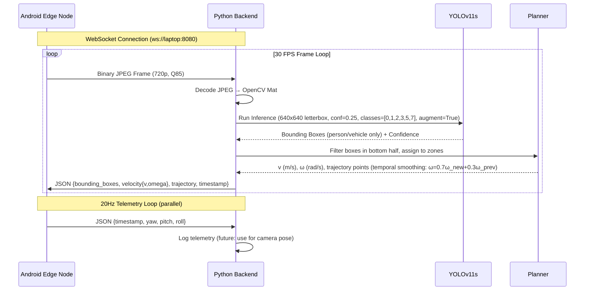
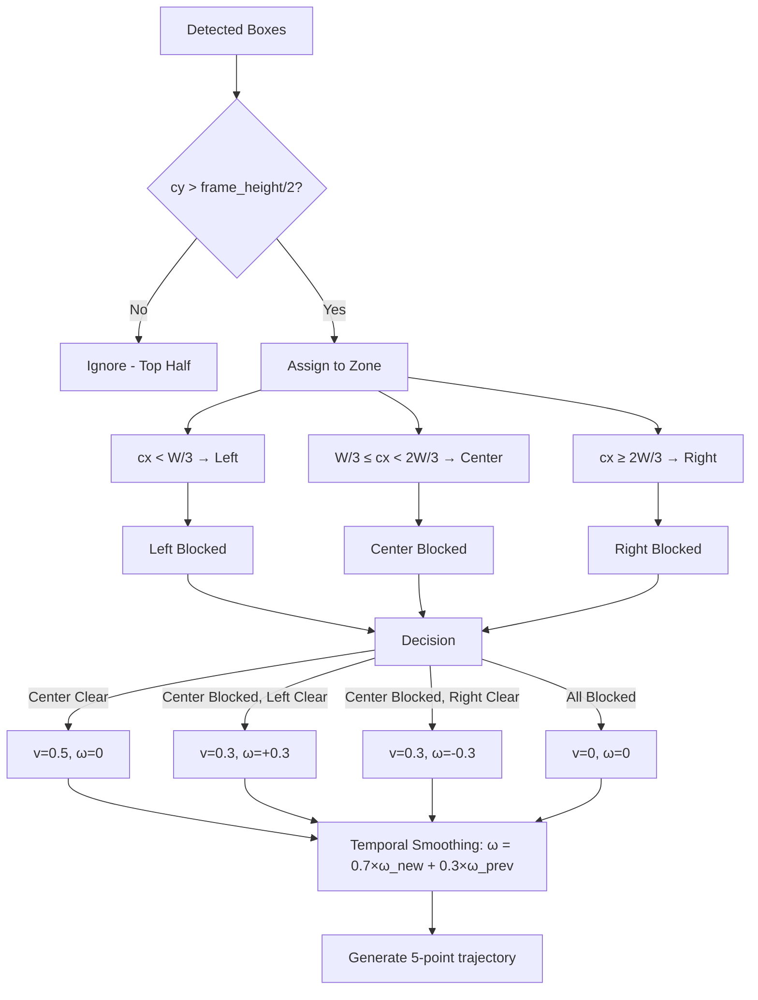

# UGV 1-Day Prototype - Backend

Python WebSocket server that receives camera frames from Android, runs **YOLOv11s** obstacle detection with class filtering, computes reactive navigation commands with temporal smoothing, and sends results back to Android for HUD display.

## Quick Start

```bash
cd prototype/backend
./setup.sh        # One-time setup (installs dependencies, downloads yolo11s.pt)
uv run python server.py
```

Server starts on `ws://0.0.0.0:8080`

**Recommended Android camera: 1280x720 @ 30fps, JPEG Q85** (backend letterboxes to 640×640)

## Architecture



## System Components

| File | Responsibility |
|------|----------------|
| `server.py` | WebSocket server, frame decoding, JSON I/O, orchestration |
| `perception.py` | `YOLODetector` - wraps Ultralytics **YOLOv11s** (conf=0.25, class filter, augment=True) |
| `planner.py` | `compute_navigation()` - 3-zone reactive obstacle avoidance + **temporal smoothing** |
| `requirements.txt` | Python dependencies |
| `yolo11s.pt` | Downloaded YOLOv11 small model (~18 MB, 47.0% mAP) |

## Data Flow

```mermaid
flowchart TD
    subgraph Android [Android Edge Node]
        Cam[CameraX Preview 720p] --> FrameCap[Frame Capture 30fps]
        FrameCap --> JPEG[JPEG Encode Q85]
        JPEG --> WSU[WebSocket Binary]
        Sensors[SensorManager] --> Telemetry[Orientation 20Hz]
        Telemetry --> WSJ[WebSocket JSON]
    end

    subgraph Backend [Python Laptop Backend]
        WSU --> Decode[Decode JPEG]
        Decode --> YOLO[YOLOv11s Inference<br/>imgsz=640, conf=0.25<br/>classes=person/vehicle, augment]
        YOLO --> Boxes[Bounding Boxes<br/>(filtered classes only)]
        Boxes --> Filter[Filter Bottom Half]
        Filter --> Zones[3-Zone Classification]
        Zones --> Plan[Reactive Planner<br/>+ Temporal Smoothing]
        Plan --> Nav{v, ω, trajectory}
        Nav --> JSON[Build Response]
        JSON --> WSD[WebSocket JSON Downstream]
        WSJ --> Log[Log Telemetry]
    end

    WSD --> HUD[Android HUD Overlay]
```

## API Specification

### Upstream (Android → Laptop)

| Message Type | Format | Rate | Description |
|-------------|--------|------|-------------|
| Video Frame | Binary (JPEG bytes) | ~30 FPS | **1280x720 (recommended)**, quality **85** |
| Telemetry | JSON | 20 Hz | `{timestamp, yaw, pitch, roll}` |

**Telemetry JSON:**
```json
{
  "timestamp": 1727345678123,
  "yaw": 12.4,
  "pitch": -2.1,
  "roll": 0.3
}
```

### Downstream (Laptop → Android)

```json
{
  "bounding_boxes": [
    {"x": 0.18, "y": 0.35, "width": 0.22, "height": 0.28, "label": "person", "confidence": 0.87}
  ],
  "velocity": {"v": 0.5, "omega": 0.0},
  "trajectory": [{"x": 0.5, "y": 1.0}, {"x": 0.5, "y": 0.8}, {"x": 0.5, "y": 0.6}, {"x": 0.5, "y": 0.4}, {"x": 0.5, "y": 0.2}],
  "timestamp": 1727345678150
}
```

**Fields:**
- `bounding_boxes` - Array of normalized bounding boxes (0.0-1.0 relative to frame)
  - `x`, `y` - Top-left corner
  - `width`, `height` - Width and height
  - `label` - COCO class name (person, bicycle, car, motorcycle, bus, truck)
  - `confidence` - Detection confidence (0.0-1.0)
- `velocity` - Object with `v` (linear m/s) and `omega` (angular rad/s, + = left)
- `trajectory` - Array of {x,y} waypoints (normalized 0.0-1.0), origin bottom-center
- `timestamp` - Server timestamp (ms since epoch)

## Reactive Planner Algorithm



## Configuration

| Parameter | Default | Location |
|-----------|---------|----------|
| WebSocket Port | 8080 | `server.py:110` |
| YOLO Model | **yolo11s.pt** | `perception.py:14` |
| Inference Size | 640 | `perception.py:26` |
| Confidence Threshold | **0.25** | `perception.py:26` |
| NMS IoU | **0.45** | `perception.py:26` |
| Class Filter | **[0,1,2,3,5,7]** | `perception.py:26` |
| Test-Time Augment | **True** | `perception.py:26` |
| Frame Resolution | **1280x720** | `CameraProvider.kt:70` |
| JPEG Quality | **85** | `CameraProvider.kt` |
| Frame Rate | 30 FPS | `CameraProvider.kt:40` |
| Telemetry Rate | 20 Hz | `StreamViewModel.kt:160` |
| Temporal Smoothing | **α=0.7** | `planner.py` |

## Testing

```bash
# Test planner logic (no dependencies)
uv run python planner.py

# Test perception with sample image
uv run python -c "
from perception import YOLODetector
import cv2
detector = YOLODetector()
frame = cv2.imread('test.jpg')
boxes = detector.detect(frame)
print(f'Detected {len(boxes)} objects')
for b in boxes:
    print(f'  {b[class]} @ ({b[x]},{b[y]}) {b[w]}x{b[h]} conf={b[confidence]:.2f}')
"

# Test full server (requires Android or websocket client)
uv run python server.py
```

## Performance Targets

| Metric | Target | Notes |
|--------|--------|-------|
| End-to-end latency | < 100ms | Frame capture → detection → response → render |
| **Inference speed (yolo11s)** | **> 30 FPS** | **RTX 3060: ~12-18ms** |
| **mAP@50-95** | **47.0%** | **vs 39.5% for yolo11n** |
| WebSocket throughput | Stable | Bidirectional, no drops |
| Android HUD | 30 FPS | Smooth overlay rendering |

## What's Missing (vs Full System)

| Full System | Prototype |
|-------------|-----------|
| VINS-Mono SLAM | No SLAM - assumes static camera |
| MPPI trajectory optimization | Simple 3-zone reactive planner |
| ROS2 C++ nodes | Pure Python single process |
| H.264 hardware encoding | JPEG compression |
| 100 Hz control loop | ~30 Hz frame rate |
| Wheel odometry feedback | No odometry |

## Troubleshooting

| Issue | Solution |
|-------|----------|
| `ModuleNotFoundError: ultralytics` | Run `./setup.sh` or `uv sync` |
| `CUDA out of memory` | Use `device="cpu"` in `YOLODetector()` or fallback to `yolo11n.pt` |
| Android can't connect | Check laptop IP: `ip route get 1.1.1.1 \| awk '{print $7}'`, firewall port 8080, same WiFi |
| No detections | Confidence is 0.25 (low) — check class filter isn't excluding target |
| High latency | Lower inference size to 320, reduce JPEG quality, or use `yolo11n.pt` |
| Jittery steering | Temporal smoothing active (α=0.7) — adjust in `planner.py` if needed |
| Model not downloading | First run auto-downloads yolo11s.pt (~18MB) — check internet |

## License

MIT - Prototype for SIH 2026